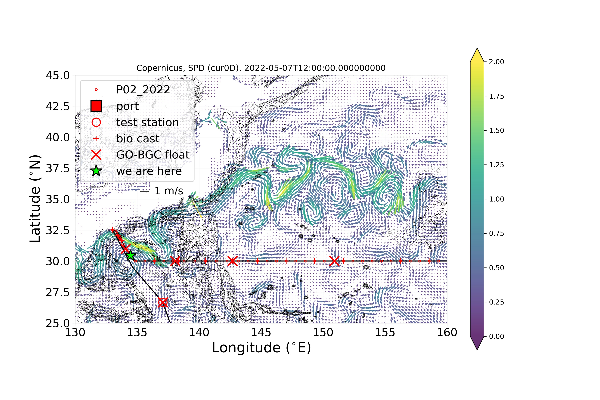

Cruise Narrative
================

The 2022 re-occupation of P02 along 30°N in the Pacific was defined by a week-long delay, a quick start, a well-defined crossing of the Kuroshio and then its large loop, deep western casts including the Izu-Ogasawara Trench, and except for one post-Kuroshio wire re-termination, supported by a nearly continuous spell of calm weather and seas, no interruption to routine deployments and recoveries.
Technical difficulties were generally minimal and short lived.

Quarantine, Delay and Transit
--------------------------------------

Most of the science party arrived in Guam by evening of April 9, glad to have the 20+ hours of masked flying time over.
One person was unable to come due to a last-minute family emergency.
A series of fortunate events led us to an eager young marine biologist from the University of Guam, who was willing to drop everything to join our Bio GO-SHIP team in the P02 pilot project that would include both bio-only casts and multiple underway measurements.
We settled into quarantine by noon on the 11th.
Amazingly, we managed to get 90% of our assorted multi-disciplinary/institutional/generational group to book rooms in the same hotel.
This has allowed us (our co-chief Shuwen Tan did all the leg work) to set up group PCR testing prior to boarding without the necessity of leaving the hotel.

Most of the pre-cruise logistical issues revolved around a lack of cargo flights from Honolulu the week prior to our load.
While most were sorted out prior to the original departure date (April 22), part of the CFC shipment was delayed until the day before our final departure of April 30).

One item of note is that on one of the cruises out Guam earlier this year a rosette was lost.
However, after a thorough investigation and the setting up of new protocols and safety features, we were confident that our GO-SHIP 36-bottle rosette would not suffer the same fate. 

While in quarantine we continued to follow the behavior of the Kuroshio as this would affect our final station plan (:ref:`Fig. 1<Fig1_narrative>`).
We held daily virtual meetings with the students and held non-required all-hands meetings (check in was required).
Our student led GO-SHIP/GO-BGC blog (can be accessed through either https://usgoship.ucsd.edu/blogs/ or https://www.go-bgc.org/expedition/north-pacific-2022/) and weekly reports (https://usgoship.ucsd.edu/2022/04/16/weekly-reports-from-2022-p02-leg-1/) were started.

.. _Fig1_narrative:

    The western end of the planned 2022 P02 track.
    Symbols represent station locations: Full-depth casts (red circles), with Bio 1000 m casts (red crosses), with GO-BGC float deployments (red "x"s).
    The green star represents the location of Station 11.
    Arrows represent the estimate of surface velocity from the Copernicus physical model for 5/07/22 12:00 UTC, the color shading indicates the amplitude of the surface velocity.

After 7 days in COVID quarantine (April 11-17), the science party boarded the R/V Revelle for MOB (April 18-22) with the intention of departing on April 22 at 16:00 (local, 10 hours ahead of UTC).
However, due to the ship's inability to hire a key member of the engineering department, the ship did not depart until 10:00 (local) on April 30th.
As we could not leave the ship, our time was well spent setting up and for the students, learning about the equipment, waiting and dealing with the shipment delays, creating a new bracket for the ODF rosette so that the upward-looking LADCP could sit above the bottles and not be crushed by the CAST-6 (:ref:`Fig. 2<Fig2_narrative>`), and decorating the floats for schools which had adopted them.
The R/V Revelle left the dock at 10:00 (local) on April 30.
Once out of the Navy Harbor, we picked up two of our science party (who had not been able to gain access to the Navy Base) via launch before heading out into open waters.

.. _Fig2_narrative:

.. figure:: images/narrative/Fig_3_New_Bracket.*

	Before (upper right) and after (upper left) views of the rosette illustrating the newly designed bracket (lower left panel) and it position protecting the rosette instrumentation as it docks with CAST-6 (lower right panel).
	
The Revelle then steamed for ~2 days before reaching the first “test” station.
It included 3 casts.
The first, a dip to 20 m to fire all bottles.
ODF, DIC, and bio took water from this cast to keep their equipment up and running over the 5-day transit.
A second cast included both core and bio sampling, and the third cast was a float deployment.
Because this station included samples analyzed and saved in support of the GO-BGC float deployment it became Sta 1.
It should be noted however that this is not a full-depth station.
After slowing to deploy a second float while in international waters, sampling on the regular line began on May 5 at 32.507°N, 133.03°E (Sta 3).

Station Spacing and Sampling Details
--------------------------------------
The actual station spacing deviated from the planned spacing mainly due to the 8-day delay in port (a protracted wait to hire a key crew member), which then prematurely closed the requested window for sampling within Japanese waters.
The close spacing coming southeast down the Japan slope was kept, but when not in steeply sloping bathymetry or frontal regions - spacing was first increased to 40 nm and then to 45 nm with one instance of 48 nm spacing.
The slightly closer spacing was based on the hope that an EEZ clearance extension would be granted.
The longer spacing occurred as the window of opportunity closed.
Having occupied a station (Sta 22, 30.000°N, 142.256°E) on the western side of the Izu-Ogasawara Trench and with no extension in sight, the planned 6000 m station in the center of the trench was cancelled in favor of a location on the eastern side (Sta 23, 30.000°N, 143.177 °E).
News of an extension came after the Sta 23 cast, only a few hours prior to the end of the original clearance, at which point spacing was reduced back to 35 nm.
Still dealing with the reduced days at sea due to the original delay, 35 nm spacing was maintained until Sta 46 (30.000°N, 158.658°E), where upon it was reduced to the standard 30 nm.
The only change to this spacing occurred at the Mercury Seamount (Sta 71-73, ~173.2°E) where the 2013 stations on either side were re-occupied and we included a shallow station at the peak in between (Sta 72).

The Bio team took rosette samples at approximately every third station on the line.
At six stations (Sta: 1, 6, 11, 14, 17, and 20) in western waters where casts were less than 5000 m deep, these samples came from 12 rosette bottles (core sampling using the other 24).
Beginning at the first 6000 m station (Sta 23) and every third station thereafter there was a separate 1000 m bio” cast, where 19 bottles were tripped (at 1000 m, 500 m, 200 m, 150 m, 2x100 m, 75 m, 40 m, and 11 x5 m or the “surface”) for what became known as “standard bio”.
On the bio stations where floats were deployed (aka “float bio”), 20 bottles were tripped (at 1000 m, 500 m, 2x200 m, below the chlorophyll max (according to the fluorometer), 2 x the chlorophyll max, above the chlorophyll max, below the mixed layer, and 11 x 5 m or the “surface”).
The bio casts took a little less than an hour to go down and up, and for the standard bio 20-30 minutes to sample and get back in the water.
They became quicker as we became more proficient at sampling.
Having the CTD watch assist was paramount to this efficiency and a sample cop was absolutely necessary to avoid mistakes.
Float bio casts took 5-10 minutes longer because they were more complicated.

There were a total of 115 full water column casts that included CTD, Bullister bottle, fluorometer, transmissometer, and upward & downward-looking LADCP and Chi-PODS.
The UVP ran for 114 of these.
There were 33 separate bio-casts and another 6 casts (in waters less than 5000 m deep) that included 12 bio-only bottles and 24 core bottles.
These combined casts required stricter use of water by both groups, but worked well without adding the extra time to the stations for bio-sampling and re-cocking & re-deployment of the rosette for a second cast (a savings of about 1.5 hours).
It should be noted however, that including the bio-casts gave the other teams (particularly CFCS, DIC, and pH/TAlk) more time to analyze their data which meant that for the most part they were able to keep up if not full sampling on all 36 bottles, then at-least two-thirds sampling on every station.

Water samples (up to 36) were collected in 10 L Bullister bottles at all stations providing water samples for CFCs/|SF6|, Total DIC, Total Alkalinity, pH, dissolved oxygen, nutrients, salinity, DOC, :math:`\text{DI}^{13/14}`\C.
There was also discrete underway sampling three times a day that included HPLC, FCM, POM (POC, PON, POP, PCOD) and genetics (DNA/RNA).
Underway surface |pCO2|, temperature, salinity, dissolved oxygen, multi-beam bathymetry and meteorological measurements were collected.
XBTs provided upper water column temperature profiles for calibration of the multi-beam on all days that CTD casts were not performed.
With few exceptions, casts were made to within 10-12 m of the bottom.
Note the exceptions are casts that were purposely made to 3-6 m in calm waters.

The standard three-station schema was used to choose sampling depths.
These schema are designed to sample the full water column over a span of the three stations (e.g. if the first station trips bottles at 600 m and 700 m, the next will sample 635 m and 735m, the third 665 m and 765, and the rotation begins again with the fourth sampling 600 m and 700 m).
Near the bottom the schema were manually manipulated to avoid gaps due to extremely flat or steeply sloped bathymetry.
Particularly near the bottom, it is not necessary to be overly concerned about hitting these depths exactly so unless the wire out is significantly different from the CTD depth, it can be used as the target.
Closer to the surface where bottle trips are more narrowly spaced, correcting the target wire out to get the desired target depth can be beneficial to the overall consistency, but being off by a meter or two at 100 m is irrelevant.
Surface bottle depth was defined by the res-tech on duty who would bring the rosette up to the “surface” for the last bottle trip.
The goal is to cover the water column, not measure a specific set of depths (:ref:`Fig. 3<Fig3_narrative>`).

.. _Fig3_narrative:

.. figure:: images/narrative/Fig_4_bottle_schema_133_200.*

    Along-track bathymetry with P02 Leg 1 occupied stations 1-117 (numbered vertical lines).
    Five panel section plot indicating depth in meters of each of the bottles tripped (blue crosses).
    Red circles indicate bottles with problems (misfires, leaking, etc).
    The pink vertical line indicates the longitude of the eastern edge of the Japanese EEZ.
    From top to bottom panels represent depth ranges 0 to <150 m, 150 to < 600 m, 600 to < 1500 m, 1500 to 3000 m, and 3000 to 6000 m. (Image credit: Shuwen Tan).

For every deployment and recovery an entry from made in the UNOLS E-logger (https://www.unols.org/sites/default/files/R2R_EventLogger.pdf) that included the transect (P02), the station # (SSS), the cast number (CC), the estimated depth from the Multibeam, the author id-name, and a possible comment.
The E-logger software provided the date/time & position stamps.
The event number that is made up of the UTC date (YYYMMDD) and time (HHMM), and a 3-digit extension was assigned by the software.
For example: 20220608.1120.001 was the recovery of the Sta 117 cast on June 8th at 11:20 UTC.
Had another operator on a different cruise entered an event at the exact same time it would have been given a different 3-digit extension.
E-logger was used consistently for the casts and for turning the EK-80 on and off during casts.
There are a few entries for the bio-underway samples, but these were not maintained consistently.
On the console log sheet, the event number was written as MMDD.HHMM without the year or 3-digit extension (neither of which changed over the course of the cruise).

Sampling and Analysis Challenges
--------------------------------

While the details of the lab and rosette issues are described and/or listed in the individual sections of this report, a few of the most notable are listed here.

Bullister 19 was a problem bottle.
We found that it would trip but then find a balance point so it would not close.
Then after various adjustments to the lanyard and raising it up, bottle 20 began periodically catching 19’s lanyard, so that 20 would not close properly.
We made an effort to adjust so as to avoid large gaps over the three-station schema rotation. Still, it was frustrating as these two bottles tended to close at the oxygen minimum.

The only truly notable data gap was when CFCs got behind for one two-day stint because of equipment failure (Sta 17-20 are missing CFC-11, CFC-12, |SF6| and |N2O|).
There are two short gaps in the |pCO2| data set that were caused by first equipment issues and secondly electrical issues in the lab.
Please see the :ref:`pCO2 section<pCO2>` for discussion of the various water intakes on the *Revelle* and their associated temperatures (that go into the |pCO2| numbers).
There is one full cast and 4 bio-casts where the transmissometer was purposely blacked out for calibration purposes.
We lost one cast of UVP data due to corrosion and then a couple of others due to the battery’s inability to handle both a bio cast and full cast in quick succession.
Later (after May 25) due to a software issue, the UVP data while still being collected, could no longer be downloaded.

One particular misstep is noteworthy.
In 2016, President Obama increased by presidential proclamation the footprint of the Papahanaumokuakea Marine National Monument to the seaward limit of the EEZ.
However, this change appears to have never been updated in the current NOAA and Coast Pilot navigation charts used by the bridge or our UCSD personnel assisting us with clearance requests and permit.
The net result was that while we thought we had closest point of approach of 90 nm, we instead occupied 16 stations, took numerous underway samples and other measurements and deployed float WMO# 5906516 within its boundaries.
We were contacted by U.S. Fish & Wildlife Service National Wildlife Refuge System Division of Refuge Law Enforcement and after multiple conversations between them, Captain Galiher and the acting UCSD Marine Superintendent Eric Buck, and contact with the UCSD Port Captain Wes Hill, it was left as an “educational opportunity”.
The captain will follow-up to make sure that this change and any others are updated into the charts they use.
The next occupation of P02 will have to acquire a permit for sampling in this region.
Such a permit should be possible as scientific research is allowed, though whether there will be any restrictions we cannot tell at this juncture.

The cruise ended in Honolulu, Hawaii on June 10th, 2011, where the small amount deMOB activity occurred.
All Leg 2 shipments also came aboard, ready for stowing.
While crew turnover occurred on the 10th, most science party members stayed on the Revelle until June 11th for cross-over discussions with the members of the Leg-2 science party who were in quarantine in Honolulu and boarded on the 11th.

Acknowledgements
------------------
We would like to thank the officers and crew of the R/V *Revelle* who have gone above and beyond to welcome us and support the science on this expedition.
They have worked with us every step of the way from handling the repercussions of the 8-day delay in port to seeing us through to the middle of the North Pacific with speed, alacrity and accuracy.
Their efforts have included:

* Not just driving the ship (big thank you to the Bridge – to Captain Heather, for her care in bringing us onto station, to our 2nd Mate and Navigator Trey for his smooth sailing into station (and apparent joy at receiving new positions), and to Henry – whoa! and just how close are you to our specified position? Was that 3.1 cm?)
* Great conversations on the bridge assisting us with our station plan and EEZ gymnastics, creating a “plankton” flag, your noontime reports to JCG, handling that misstep with a marine preserve and finding the quickest route home (thank you for our early morning chats, Trey and Captain Heather)
* Running our winch through all hours of the day and night, providing some enjoyable radio chatter (thank you Bob, Joey, Jake, Feivel and Gomez; Gomez thank you too for the fantastic blog post and inspired artwork)
* Feeding us outstanding cuisine – an amazing variety of soups, taco Tuesdays, Sunday dinners, always a vegetarian option or two or three, an array of birthday cakes, muffins and cookies, and crème brulée after our last full day of sampling – we can’t thank you enough Jay and Mark, and a great murmuring of thanks from the night-shift to Trey for bringing out 4 am delicacies.
* Burning those pesky insect-ridden float boxes (thank you Joe and Fievel), your care use of chemical products Joe and for everything else required after the winch work took over your labor force.
* Sorting out winch and wire challenges and fixing everything from the smallest detail to the greatest problems (the list is long here, big thank you to our res-techs Josh and Royhon, our Bosun Joe, our chief engineer Chance (love that bracket) and Harry as well as all the engineers for ship and equipment up and running).
* Thank you to our Chief Mate Michael for wonderful stories and sound advice and to all the other friendly faces in the passageways and mess: Daryl, Delvin, Jeffrey, Brian, Pete, and Bobby.
* Thanks to all of you from all of us for speeding us along so that we could sample the full line with minimal loss of data and have some fun while we were doing it.

We would also like to recognize the tremendous assistance we received from Hannah Delapp at UCSD and Sasaki Eriko at MOFA with sorting out the initial Japan clearance request (MSR), and then Hannah along with Junko Nagahama at the State Dept for making the extension possible.
Lastly co-chief sci, Shuwen and chief sci, Alison would like to thank Natalie Freeman (who, although chosen, was unable to sail as co-chief for Leg 2) for her assistance with model output software and sending us weather and current updates, as well as Andreas Thurnherr, chief sci for Leg 2 for the fantastic pre-cruise discussion and collaboration.
Best of good fortune, calm winds and following seas to Leg 2.