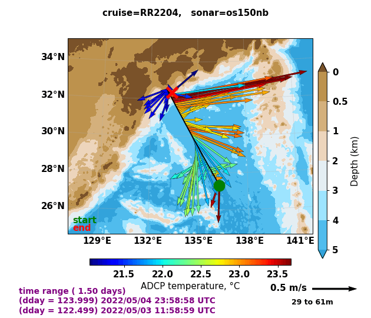
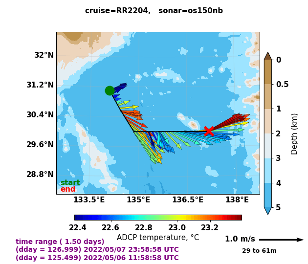

Cruise Narrative
================

1. Kuroshio Large Meander
---------------------------------------

Unlike 1994, 2004, and 2013 P02 occupations, the Kuroshio during the occupation of leg 1 was in its Large Meander (LM) status rather than in the mode where it takes a “straight” path following the coastline of Japan.
This Large Meander event started at the beginning of 2018 and still exists today (10th June 2022).
This makes it the longest-lasting event in the eight LM events that have taken place since 1950, i.e., at least 4 years compared to a typical 1 to 2-year lifespan ([Qui2021]_).
We were able to visualize the Kuroshio LM live thanks to the Ship-board ADCP (SADCP) and the vector plot that were updated every 5 mins.
Qiu and Chen (2021) suggest that the persistence of Kuroshio LM is due to a constant feed of intense anticyclonic eddies shed from the Subtropical Countercurrent.
During the period of Kuroshio-related occupation (May 4 to 7 UTC), an anti-cyclonic eddy located west of the Kuroshio LM was recognized in the Copernicus model data being sent to those on board and Stations 9-12 (May 6) were able to sample the northeastern edge of that eddy (see in Fig.1 and near the waypoint in Fig. 2).
BGC-Float was deployed at Station 11 on May 6.

  SADCP-based surface (29 m to 61 m average) current velocities (arrows) and temperature (colormap) during the period of May 3th-4th.
  Dark red arrows north of 31.2°N and near 137°E indicate the warm and rapid Kuroshio and its deviation from the coastline.
  (Source: UHDAS 5-mins surface vector plot, University of Hawaii UHDAS system, https://currents.soest.hawaii.edu/uhdas_fromships.html)

  SADCP-based surface (29 m to 61 m average) current velocities (arrows) and temperature (colormap) during the period of May 6th-7th.

2. Rough Topography: Izu-Ogasawara Ridge and the Mercury Seamount
---------------------------------------------------------------------------------------------------

In addition to repeating the previously occupied WOCE/CLIVAR stations, some stations in Leg-1 are intentionally adjusted to measure water properties near rough topography (Fig. 3: 018, 019, 073 on top of ridges/seamounts; 071, 072, 074 on the slope).
From LADCP data alone (preliminary results from Kurtis Anstey and interpretation by Andreas Thurnherr), we are excited to report prominent internal wave signals and features in turbulent dissipation rates (:math:`\epsilon`) that appear to be associated with rough topography.
The former can be visualized from the periodic horizontal velocities throughout the water column (Fig. 4).
Large :math:`\epsilon` are found above 1500 m at stations on top of ridges/seamounts and bottom-intensified :math:`\epsilon` are found on the slope of the seamount (station 072).

.. figure:: images/narrative/SRTM15_P02_0519_sta17.*

    Map of station locations over the western part of the Izu-Ogasawara Ridge overlaid on the SRTM 15 arcsecond bathymetry profiles of the turbulent kinetic energy dissipation rate ([Tozer2019]_).

.. figure:: images/narrative/SRTM15_P02_0519_sta72.*

    Map of station locations near the Mercury Seamount located northwest of the Hawaiian Ridge overlaid on the SRTM 15 arcsecond bathymetry profiles of the turbulent kinetic energy dissipation rate ([Tozer2019]_).

.. figure:: images/narrative/ladcp_seamount_uv.*

.. figure:: images/narrative/ladcp_seamount_VKE.*

    Horizontal velocities from LADCP measurements at the four stations (the 01 and 02 values after the station numbers enumerate the cast). (Image credit Shuwen Tan).

3. EK-80 Remarks
---------------------

EK-80 fisheries sonar has been turned on during the deployment of both bio casts and core casts throughout the cruise.
Thanks to the real-time display, identifying and interpreting interesting features has become a source of great interest for many in the computer lab.
Fascinating features including Kelvin-Helmholtz billows (Fig. 3), internal waves at the thermocline, internal waves in the wake of the ship, and possibly(?) a whale with babies were identified and archived as screenshots.
The EK-data from the cruise will also be archived.

.. figure:: images/narrative/D20220515_T061122_Image.*

    EK-80 monitor output (x-axis is time, y-axis is depth) during Station 38 which had two casts on 1430-2030 May 15 (local time = UTC+11).
    The subpanels show results from different frequencies which translate into resolution of different depth ranges from left to right a) ES200 0-300, b) ES120 0-500, c) ES70 0 -1000, d) ES38 0-3000 and e) ES18 0-bottom.

4. North Pacific Mode Water
----------------------------

North Pacific Subtropical Mode Water (NPSTMW) is formed to the east/south of Kuroshio/Kuroshio Extension in the late winter and early spring.
Subducted, it tends eastward, and like all mode waters is well mixed and is therefore recognizable by its low potential vorticity (see band of purple to blue colors centered at about 200 m in Fig. 5).
In the North Pacific, there is an Eastern Subtropical Mode Water as well.
With overlapping characteristics, the two are distinguished as existing to the east and west of the date line (180° longitude lies almost directly under the “o” in the title word “Vorticity”).
NPSTMW is only one of several mode waters formed in the northwestern Pacific which is an area rich frontal zones and meteorology conducive to mode water formation.
Here one can see the high PV in the region of the Kuroshio and its meander reaching down to 600-700 m.
The latter is particularly strong in 2022 (upper panel, see Section 1 above discussion the meander dynamics).
In both years, NPSTMW reaches to about 400 m, the expected depth of winter mixing according to the literature, and as expected.
These waters rise as they cross the basin eastward.
That said, the character of the NPSTMW layer as well as the water above seem different in the two occupations.
While this may be an actual difference, it seems likely that the low 2013 station spacing (even lower than in 2012) may be playing a role in creating this apparent difference.
Time of year may also be a factor as the 2022 occupation began nearly a full month later at a sensitive time of year for this water mass.
We note that radiocesium isotopes originating from the Fukushima Dai-ichi Power Plants and measured on the 2013 occupation suggest that the NPSTMW at 161°E (~ 2700 km) is no more that 2 years old ([Yoshida2015]_).

.. figure:: images/narrative/cruise_stations.*

    Along-track bathymetry and occupied stations (numbered vertical lines, Leg 1, 1-117).
    Depths of tripped bottles and unfired/leaked/unclosed bottled are indicated in blue crosses and red circles, respectively.
    The pink vertical line indicates the longitude of the Japanese EEZ.
    (Image credit: Shuwen Tan).

.. [Qui2021] Qiu, B., and Chen, S. (2021). Revisit of the Occurrence of the Kuroshio Large Meander South of Japan. Journal of Physical Oceanography 51, 12, 3679-3694

.. [Tozer2019] Tozer, B, Sandwell, D. T., Smith, W. H. F., Olson, C., Beale, J. R., & Wessel, P. (2019). Global bathymetry and topography at 15 arc sec: SRTM15+. Earth and Space Science, 6, 1847. https://doi.org/10.1029/2019EA000658

.. [Yoshida2015] Yoshida, S., A. M. Macdonald, S. R. Jayne, I. I. Rypina and K. O. Buesseler (2015) Observed eastward progression of the Fukushima 134Cs signal across the North Pacific, GRL, doi: 10.1002/2015GL065259.